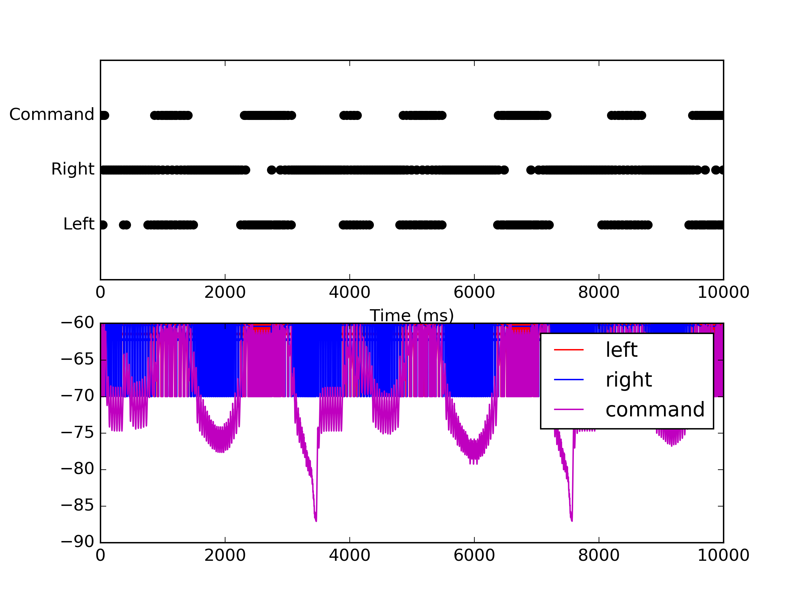
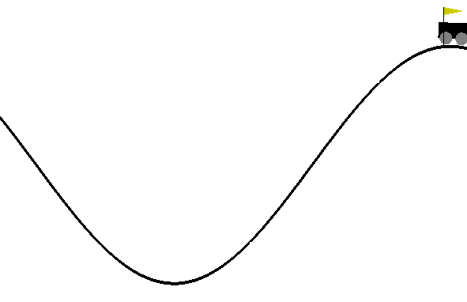

Tutorial: Interfacing NEST and OpenAI Gym
=========================================

The following are step-by-step instructions to interfacing a neural network simulation in NEST with a reinforcement-learning environment from OpenAI Gym.
We start from scratch, with simple Python scripts that communicate data via ZeroMQ and end up with a toy network model that is able to solve the MountainCar environment (without learning and only if the initial conditions are suitable).
This tutorial does not aim at constructing a sophisticated RL network model but focuses on the technical aspects, preparing the reader for creating their own models.
In case you are impatient and would directly see the whole toolchain in action, you can jump to TLDR_.

Example 0: Python to Python via ZeroMQ
--------------------------------------

Preparations:

- Install PyZMQ via pip <https://pypi.python.org/pypi/pyzmq>

.. code:: bash

          $ pip install pyzmq

- Clone this repository and navigate to ``example0/``

.. code:: bash

          $ git clone git@github.com:jakobj/nestrl-tutorial.git && cd nestrl-tutorial/example0/


We start by sending data from one Python process to another via ZeroMQ sockets <http://zeromq.org/>, see <https://pyzmq.readthedocs.io/en/latest/index.html> for the PyZMQ documentation.

We use a specific message format based on JSON to communicate between processes.
All messages are list of dictionaries, with each dictionary containing an observed value, the limits of this value and a timestamp.
The limits are necessary to normalize the data in subsequent MUSIC adapters and the timestamp is used to detect desynchronization between different parts of the toolchain.
The length of the list depends on the number of independent channels we need.
A simple message with one channel looks similar to the following:

.. code:: javascript

          [{'min': -2, 'max': 1, 'value': 0.1, 'ts': 1508443240.706507}]

To communicate between processes asynchronously, we use a publisher/subscriber model (<https://rfc.zeromq.org/spec:29/PUBSUB/>).
In this example (see ``zmq_sender.py``, ``zmq_receiver.py``), we set up a publisher (``zmq.PUB``) that continuously sends out a sine wave for ``t_max`` seconds with a time step between two messages of ``dt``.
The receiver registers as a subscriber (``zmq.SUBSCRIBE``) to the publisher.

You can run this example by executing the sender in one terminal and simultaneously the receiver in another. Both scripts should print messages to the screen continuously.

.. code:: bash

          $ ./zmq_sender.py
          $ ./zmq_receiver.py


Example 1: Python to Python via ZeroMQ & MUSIC
----------------------------------------------

Preparations:

- Download and install MUSIC from <https://github.com/INCF/MUSIC>
- Download and install MUSIC adapters from <https://github.com/incf-music/music-adapters>
- Set your paths properly

.. code:: bash

          export PATH=<MUSIC-install>/bin:$PATH
          export LD_LIBRARY_PATH=<MUSIC-install>/lib:$LD_LIBRARY_PATH
          export PATH=<music-adapters-install>/bin:$PATH
          export LD_LIBRARY_PATH=<music-adapters-install>/lib:$LD_LIBRARY_PATH

- Navigate to ``example1/``

We now include a MUSIC adapter in the loop.
We will use the Python scripts from the previous example to send and receive data, but rectify the sine wave using a threshold adapter.
The MUSIC setup is defined in a config file, in which we specify the various adapters, their configuration and how they are connected to each other.
For details on this configuration file, see the MUSIC docs at <http://insert-link-to-music-doc>.
For documentation for the various adapters see <http://insert-link-to-music-adapters-doc>.

To convert messages from the ZeroMQ domain to MUSIC-compatible data, we use a ``zmq_cont_adapter`` (read "ZeroMQ->Continuous value adapter").
This adapter can read messages in the format defined above, and converts them to to continuous values communicated via MUSIC.
This data is then send to a ``threshold_adapter`` which can be configured to replace all negative values with zero.
To transform this continuous data from MUSIC back to our message format, we use a ``cont_zmq_adapter``.
The full config then has the following content (``example1/config.music``):

.. code:: ini

          stoptime=5.
          rtf=1.
          [zmq_cont]
            binary=zmq_cont_adapter
            np=1
            music_timestep=1.01
            message_type=GymObservation
            zmq_topic=
            zmq_addr=tcp://localhost:5556
          [threshold]
            binary=threshold_adapter
            np=1
            music_timestep=1.01
            is_heaviside=false
          [cont_zmq]
            binary=cont_zmq_adapter
            np=1
            music_timestep=1.01
            message_type=GymObservation
            min=-1.
            max=1.
            zmq_topic=
            zmq_addr=tcp://*:5557
          zmq_cont.out->threshold.in[1]
          threshold.out->cont_zmq.in[1]

Note that since the ``cont_zmq_adapter`` sends data via port ``5557``, we need to specify this port also in ``zmq_receiver.py``.
If this would still be set to ``5556``, it would directly receive data from ```zmq_sender.py``.

Run the example by starting the sender and receiver, and running MUSIC with the corresponding config file and an appropriate number of processes.
You should see a similar output as in the first example, but now all negative values are set to zero due to the threshold adapter.

.. code:: bash

          $ ./zmq_sender.py
          $ ./zmq_receiver.py
          $ mpirun -np 3 music config.music


Example 2: Python to NEST via ZeroMQ & MUSIC
--------------------------------------------

Preparations:

- Download and install NEST from <https://github.com/nest/nest-simulator>;
  Do not forget to set `-Dwith-music=ON` while running cmake
- Set your paths properly

.. code:: bash

          export PYTHONPATH=<nest-simulator-install>/lib/<python-version>/site-packages:$PYTHONPATH

- Navigate to ``example2/``

The previous example has demonstrated how to send data from a Python script via ZeroMQ to MUSIC and back.
We can now use the MUSIC devices available in NEST, also called MUSIC proxies, to receive data in a running simulation.

Here, we interpret the continuous data generated by our Python script as a rate of a regular spike train.
To convert this continuous value into spikes, we connect the output of the ``zmq_cont_adapter`` to a ``rate_encoder``, that generates a regular spike train with the given rate.
The rate of the spike train is determined by the continuous value relative to the ``min`` and ``max`` values and scaled to the ``rate_min`` and ``rate_max`` values defined in the config for this adapter.
For example, for the message ``[{'min': -2, 'max': 1, 'value': 0.1, 'ts': 1508443240.706507}]``, and ``rate_min=0``, ``rate_max=100`` the adapter would generate a spike train with rate ``(0.1 + 2) / (2 + 1) * 100 = 70`` spikes/s.

In NEST, we create a MUSIC proxy that receives spikes (``music_event_in_proxy``).
Here we need to specify the port name also defined in the MUSIC config to receive data ("in").
In our example, this proxy projects to a neuron from which we record the spike train, and an additional neuron from which we can record the free membrane potential.

Run the example by starting the sender and receiver, and running MUSIC with the corresponding config file and an appropriate number of processes.
After the simulations has finished you should see a plot of the spikes and the free membrane potential of the neuron receiving input from our Python script.

.. code:: bash

          $ ./zmq_sender.py
          $ mpirun -np 3 music config.music

.. image:: example2/nest_output.png


Example 3: OpenAI Gym to NEST via ZeroMQ & MUSIC
------------------------------------------------

Preparations:

- Install OpenAI Gym via pip (<https://pypi.python.org/pypi/gym>)

.. code:: bash

          $ pip install gym

- Install gymz via pip (<https://pypi.python.org/pypi/gymz>)

.. code:: bash

          $ pip install gymz

This example introduces OpenAI Gym into the loop.
We set up a simulation in which neurons in NEST receive input from observations from an environment in OpenAI Gym.
We use the ``MountainCar-v0`` (<https://gym.openai.com/envs/MountainCar-v0/>) environment and two neurons that encode in their activity whether the car is in the left half, or the right half of the environment.

Instead of relying on the ``zmq_sender.py`` script, we use gymz to convert observations from the environment into messages that are communicated via ZeroMQ.
This requires a configuration script in JSON format, in our case containing the following:

.. code:: javascript

          {
              "All":
              {
                  "write_report": false
              },
              "Env":
              {
                  "env": "MountainCar-v0",
                  "inter_trial_observation": [-0.3, 0.0]
              },
          }

You can find the default configuration containing all options here <https://github.com/INM-6/python-gymz/blob/master/gymz/DefaultConfig.json>.
Here we disable reporting to avoid having to clear output files for multiple runs, set the correct environment and choose the position of the vehicle between two subsequent trials exactly in the middle between the leftmost corner of the environment and the goal position. This is not necessary, but simplifies interpretation of the output.

The observations are communicated via gymz in the same format as introduced above, including limits in addition to values, allowing the encoder to translate the continous value of an OpenAI Gym observation to the rate of a spike train.
In this particular environment, the observations are two dimensional, with the first dimension encoding the position and the second dimension encoding the velocity of the car.
Here we ignore the velocity, and only communicate the position to NEST.

In NEST, we create two neurons.
The ``music_event_in_proxy`` projects with negative weight to the first, and with a positive weight to the second neuron.
In the absence of inputs, the first neuron spikes autonomously, while the second one is silent.
For the leftmost position, the first neuron is hence active, while for the rightmost position, the second neuron is active.
Both neurons should have comparable rate when the car is in the middle between the leftmost boundary and the goal position, and we compensate for the offset by adjusting their resting potential according to the expected input.

Run the example by starting gymz and MUSIC with the corresponding config files. Since the car is just wobbeling around at the bottom of the trough, typically a bit on the left, you should observe that the rates of the left and right neuron increase in turns with the left neuron being more active than the right.

.. code:: bash

          $ gymz-controller gym gym_config.json
          $ mpirun -np 3 music config.music

.. image:: example3/nest_output.png


Example 4: OpenAI Gym to NEST and back via ZeroMQ & MUSIC
---------------------------------------------------------

Preparations:

- Get ready to solve your first OpenAI Gym environment with a network model simulated in NEST

In this step we close the loop between the environment and the network by interpreting the activity of a neuron in the NEST simulation as a command for the agent.
Instead of constructing a reinforcement-learning network model, we present a hard-wired solution here.

The `MountainCar-v0` environment expects the command to be an integer in {0, 1, 2}, where zero means accelerate left, one corresponds to no action and two mean accelerate right.
We use an additional neuron to encode the command.
This neuron has a resting potential equal to its threshold and receives excitatory input from the neuron encoding the left position and inhibitory input from the neuron encoding the right position.
Consequently, it will be active if the car is on the left side, which should lead to the command "accelerate right" and silent if it is on the right side, encoding "move left".
This allows the car to gain momentum by swinging back and forth until it has enough speed to make it up to the goal position.
This command neuron projects to a MUSIC proxy, ``music_event_out_proxy`` communicating spikes to MUSIC.

In the MUSIC config, we set up a decoder, that translates the spiking data into a continous rate by filtering it with a exponential kernel (``linear_decoder``).
Afterwards the data is passed to a ``threshold`` adapter, converting the continous value to the command zero or two as required by the environment.
Note that we interpret rates below one spike/s as off, and everything higher as on.
The ``cont_zmq_adapter`` finally communicates the value via ZeroMQ to gymz and hence the environment.

Fasten your seatbelt and run the example by starting gymz and MUSIC with the corresponding config files. You should observe the car swining back and forth between the two hills and sometimes reaching the goal positions.

.. code:: bash

          $ gymz-controller gym gym_config.json
          $ mpirun -np 6 music config.music




.. _TLDR:

TLDR
====

1. Download and install MUSIC from <https://github.com/incf-music>
2. Download and install MUSIC adapters from <https://github.com/incf-music/music-adapters>
3. Download and install NEST from <https://github.com/nest/nest-simulator>;
   Do not forget to set `-Dwith-music=ON` while running cmake
4. Install PyZMQ via pip <https://pypi.python.org/pypi/pyzmq>

.. code:: bash

          $ pip install pyzmq

5. Install OpenAI Gym via pip (<https://pypi.python.org/pypi/gym>)

.. code:: bash

          $ pip install gym

6. Install gymz via pip (<https://pypi.python.org/pypi/gymz>)

.. code:: bash

          $ pip install gymz

7. Make sure to have all paths set correctly

.. code:: bash

          export PATH=<PREFIX>/MUSIC/install/bin:$PATH
          export LD_LIBRARY_PATH=<PREFIX>/MUSIC/install/lib:$LD_LIBRARY_PATH
          export PATH=<PREFIX>/music-adapters/install/bin:$PATH
          export LD_LIBRARY_PATH=<PREFIX>/music-adapters/install/lib:$LD_LIBRARY_PATH
          export PATH=<PREFIX>/nest-simulator/install/bin:$PATH
          export PYTHONPATH=<PREFIX>/nest-simulator/install/lib/python3.5/site-packages:$PYTHONPATH

8. Clone this repository, navigate to ``example4/`` and run it

.. code:: bash

          $ git clone git@github.com:jakobj/nestrl-tutorial.git && cd nestrl-tutorial/example4/
          $ gymz-controller gym gym_config.json
          $ mpirun -np 6 music config.music
