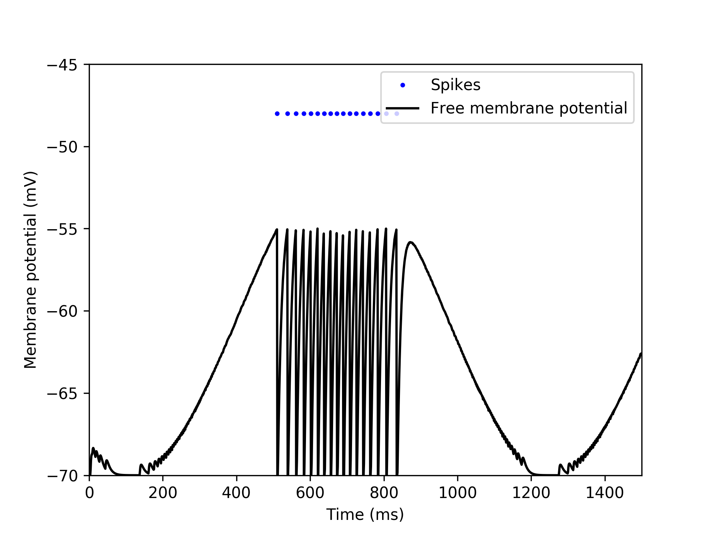

Tutorial: Interfacing NEST and OpenAI Gym
=========================================

Preparations
------------

You first need to install a variety of tools:

1. Download and install MUSIC from <https://github.com/incf-music>
2. Download and install MUSIC adapters from <https://github.com/incf-music/music-adapters>
3. Download and install NEST from <https://github.com/nest/nest-simulator>
   Do not forget to set `-Dwith-music=ON`
4. Install OpenAI Gym via pip (<https://pypi.python.org/pypi/gym>)
5. Install gymz via pip (<https://pypi.python.org/pypi/gymz>)

[IDEA: build everything up from scratch, only introduce one new script at a time]

[postpone installation of the required components as far as possible to minimize frustration and create a TLDR for the impatient]

[lighten the style, this is currently a huge wall of text]

[before you start, please make sure to have all paths set correctly (see add_paths.sh)]

Example 0: Python to Python via ZeroMQ
--------------------------------------

Preparations:

- Install PyZMQ via pip <https://pypi.python.org/pypi/pyzmq>
- Clone this repository and navigate to example0/

We start by sending data from one Python process to another via ZeroMQ sockets <http://zeromq.org/>, see <https://pyzmq.readthedocs.io/en/latest/index.html> for the PyZMQ documentation.

We use a specific message format based on JSON to communicate between processes.
All messages are list of dictionaries, with each dictionary containing an observed value, the limits of this value and a timestamp.
The limits are necessary to normalize the data in subsequent MUSIC adapters and the timestamp is used to detect desynchronization between different parts of the toolchain.
The length of the list depends on the number of independent channels we need.
A simple message with one channel, would hence look similar to the following:

.. code:: javascript

          [{'min': -2, 'max': 1, 'value': 0.1, 'ts': 1508443240.706507}]

To communicate between processes asynchronously, we use a publisher/subscriber model.
In this example, we set up a publisher (``zmq.PUB``) that continuously sends out a sine wave for ``t_max`` seconds with a time step between two messages of ``dt`` (see ``sender.py``).
The receiver registers as a subscriber (``zmq.SUBSCRIBE``) to the publisher (see ``zmq_receiver.py``).

You can run this example by starting the sender in one terminal and the receiver in another. Both scripts should print messages to the screen continuously.

.. code:: bash

          $ ./zmq_sender.py
          $ ./zmq_receiver.py


Example 1: Python to Python via ZeroMQ & MUSIC
----------------------------------------------

Preparations:

- Download and install MUSIC from <https://github.com/incf-music>
- Download and install MUSIC adapters from <https://github.com/incf-music/music-adapters>
- Set your paths properly

.. code:: bash

          export PATH=<MUSIC-install>/bin:$PATH
          export LD_LIBRARY_PATH=<MUSIC-install>/lib:$LD_LIBRARY_PATH
          export PATH=<music-adapters-install>/bin:$PATH

- Nagivate to example1/

We now include a MUSIC adapter in the loop.
We will use the Python scripts from the previous example to send and receive data, but rectify the sine wave using a threshold adapter.
The MUSIC setup is defined in a config file, in which we specifiy the various adapters, their configuration and how they are connected to each other.
For details on this configuration file, see the MUSIC docs at <http://insert-link-to-music-doc>.
For documentation for the various adapters see <http://insert-link-to-music-adapters-doc>.

To convert messages from the ZeroMQ domain to MUSIC-compatible data, we use a ``zmq_cont_adapter`` (read "ZeroMQ->Continuous value adapter").
This adapter can read messages in the format defined above, and converts them to to continuous values communicated via MUSIC.
This data is then send to a ``threshold_adapter`` which can be configured to replace all negative values with zero.
To transform this continuous data from MUSIC back to our message format, we use a ``cont_zmq_adapter``.
The full config then has the following content (``example1/config.music``):

.. code:: ini

          stoptime=5.
          rtf=1.
          [zmq_cont]
            binary=zmq_cont_adapter
            np=1
            music_timestep=0.01
            message_type=GymObservation
            zmq_topic=
            zmq_addr=tcp://localhost:5556
          [threshold]
            binary=threshold_adapter
            np=1
            music_timestep=0.01
            heaviside=0
            threshold=0
          [cont_zmq]
            binary=cont_zmq_adapter
            np=1
            music_timestep=0.01
            message_type=GymObservation
            min=-1.
            max=1.
            zmq_topic=
            zmq_addr=tcp://*:5557
          zmq_cont.out->threshold.in[1]
          threshold.out->cont_zmq.in[1]

Note that since the ``cont_zmq_adapter`` sends data via port 5557, we need to specify this port also in ``zmq_receiver.py``.
If this would still be set to 5556, it would directly receive data from ```zmq_sender.py``.

Run the example by starting the sender and receiver, and running MUSIC with the corresponding config file and an appropiate number of processes.
You should see a similar output as in the first example, but now all negative values are set to zero due to the threshold adapter.

.. code:: bash

          $ ./zmq_sender.py
          $ ./zmq_receiver.py
          $ mpirun -np 3 music config.music


Example 2: Python to NEST via ZeroMQ & MUSIC
--------------------------------------------

Preparations:

- Download and install NEST from <https://github.com/nest/nest-simulator>.
  Do not forget to set `-Dwith-music=ON` while running cmake.
- Set your paths properly

.. code:: bash

          export PYTHONPATH=<nest-simulator-install>/lib/<python-version>/site-packages:$PYTHONPATH

Since the previous example has already demonstrated how to send data from a Python script via ZeroMQ to MUSIC and back, the hardest part is already over.
We can now use the MUSIC devices available in NEST, also called MUSIC proxies, to receive data in a running simulation.

Here, we intepret the continous data generated by our Python script as a rate of a regular spike train.
To convert this continuos value into spikes, we connect the output of the ``zmq_cont_adapter`` to a ``rate_encoder``, that generates a regular spiketrain with the given rate.
The rate of the spiketrain is determined by the continuous value relative to the ``min`` and ``max`` values and scaled to the ``rate_min`` and ``rate_max`` values defined in the config for this adapter.
For example, for the message ``[{'min': -2, 'max': 1, 'value': 0.1, 'ts': 1508443240.706507}]``, and ``rate_min=0``, ``rate_max=100`` the adapter would generate a spiketrain with rate ``(0.1 + 2) / (2 + 1) * 100 = 70`` spikes/s.

In NEST, we create a MUSIC proxy that receives spikes (``music_event_in_proxy``).
Here we need to specify the portname also defined in the MUSIC config to receive data ("in").
In our example, this proxy projects to a neuron from which we record the spike train, and an additional neuron from which we can record the free membrane potential.


Run the example by starting the sender and receiver, and running MUSIC with the corresponding config file and an appropiate number of processes.
After the simulations has finished you should see a plot of the spikes and the free membrane potential of the neuron receiving input from our Python script.

.. code:: bash

          $ ./zmq_sender.py
          $ mpirun -np 3 music config.music




Example 3: OpenAI Gym to NEST via ZeroMQ & MUSIC
------------------------------------------------

now create a simple setup in which we use the toolchain to feed observations from an environment from OpenAI Gym into a simulation with two neurons that mimic place cells
we use the MountainCar environment and the neurons respond to to the agent being in the left half, and the right half of the screen, respectively


Example 4: OpenAI Gym to NEST and back via ZeroMQ & MUSIC
---------------------------------------------------------


TODO (what I realized is missing during writing this)
=====================================================
- explain every entry in default config
- documentation for all adapters/encoders
- explain message types
- MUSIC is not very user friendly in terms of error messages, we should help to improve this
